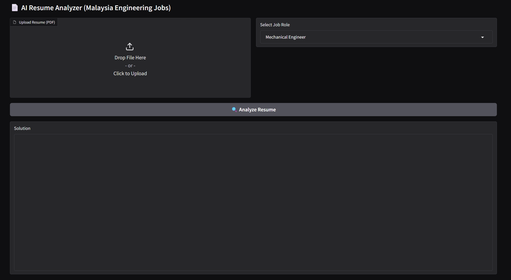

# 📄 AI Resume Analyzer (Malaysia Engineering Jobs)

An AI-powered prototype that analyzes engineering resumes and matches them with job roles in Malaysia.  
Built with **RAG (Retrieval-Augmented Generation)** and **LLMs (Phi-2 from Hugging Face)**.  

---

## 🚀 Workflow
Resume (PDF) → PyMuPDF (extract text) → Knowledge Base (RAG) → Phi-2 (LLM) → Structured Output


---

## ✨ Features
- Upload a **resume (PDF)**  
- Choose a job role (e.g., Mechanical Engineer, AI Engineer, Software Engineer) OR let AI suggest suitable jobs  
- AI compares resume with **knowledge base of Malaysian engineering jobs**  
- Provides:
  - ✅ Strengths (what matches the job)  
  - ⚠️ Weaknesses (what’s missing)  
  - 💡 Improvements (how to be competitive)  

---

## 🛠️ Tech Stack
- [Python 3.10+](https://www.python.org/)  
- [PyMuPDF](https://pymupdf.readthedocs.io/) → Resume text extraction  
- [FAISS](https://github.com/facebookresearch/faiss) *(future extension for vector search)*  
- [Hugging Face Transformers](https://huggingface.co/docs/transformers/) → LLM (Phi-2)  
- [Gradio](https://gradio.app/) → Simple interactive UI  

---

## 📂 Project Structure
.
├── prototype.py # Main application file
├── knowledge_base.txt # Engineering job descriptions (RAG knowledge base)
├── requirements.txt # Python dependencies
└── README.md # Project documentation

---

## ⚡ Installation & Usage

### 1️⃣ Clone repo
```bash
https://github.com/Reaganhoo/ai_resume.git
cd ai_resume

###2️⃣ Install dependencies
```bash
pip install -r requirements.txt

###3️⃣ Run the app
```bash
prototype app.py

Gradio will launch on:
👉 http://127.0.0.1:7860 (local)
👉 Public link available if you set demo.launch(share=True)

📸 Demo UI



🤝 Contributing

Pull requests are welcome!
For major changes, please open an issue first to discuss what you’d like to change.

📢 Acknowledgements

Model: Microsoft Phi-2
 from Hugging Face

Resume parsing: PyMuPDF

UI: Gradio

🧑 Author

Hoo Weng Lok
📍 Malaysia | 🎓 Mechatronics Engineering Student | 🤖 AI Enthusiast


